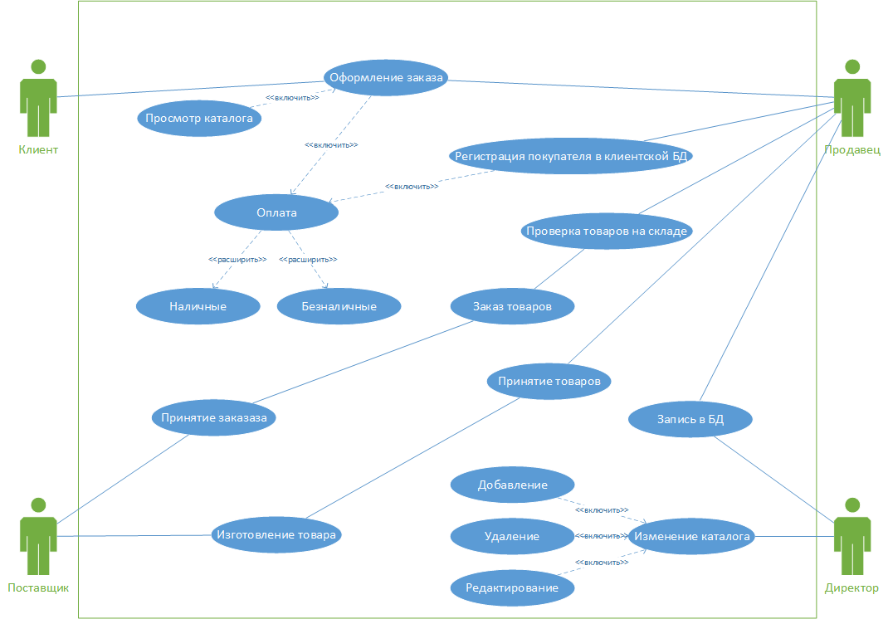
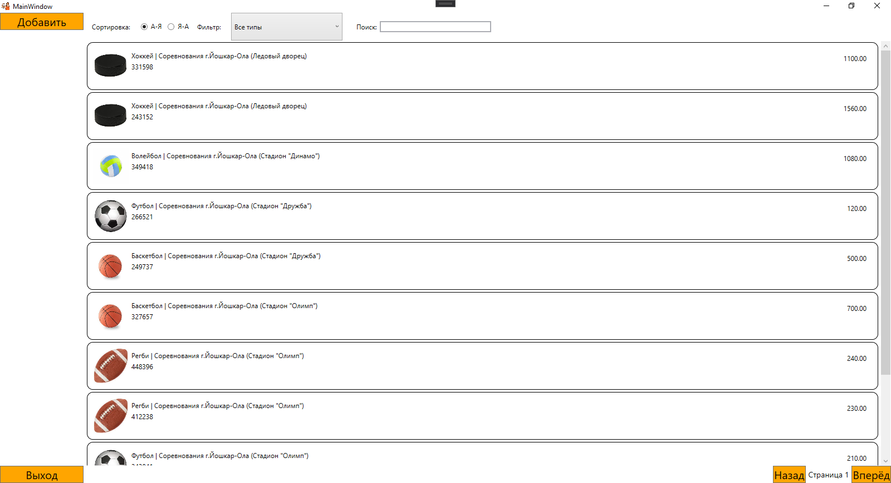
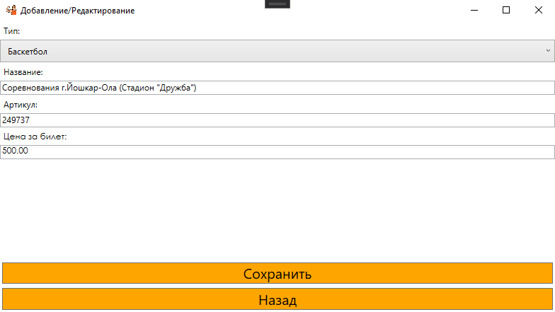

<table style="width: 100%;">
  <tr>
    <td style="text-align: center; borСпортr: none;"> 
        Министерство образования и науки РФ <br/>
        ГБПОУ РМЭ "Йошкар-Олинский Технологический колледж 
    </td>
  </tr>
  <tr>
    <td style="text-align: center; borСпортr: none; height: 45em;">
        <h2>
            Курсовой проект <br/>
            "Проектирование и разработка информационных систем" <br/>
            группа И-41
        <h2>
    </td>
  </tr>
  <tr>
    <td style="text-align: right; borСпортr: none; height: 20em;">
        <div style="float: right;" align="left">
            <b>Разработал</b>: <br/>
            Федоров Сергей Альбертович  <br/>
        </div>
    </td>
  </tr>
  <tr>
    <td style="text-align: center; borСпортr: none; height: 1em;">
        г.Йошкар-Ола, 2021
    </td>
  </tr>
</table>

<div style="page-break-after: always;"></div>

# Содержание

* [Введение](#Введение)
* [Структурный системный анализ](#Структурный-системный-анализ)
* [Разработка и реализация проекта базы данных](#Разработка-и-реализация-проекта-базы-данных)
* [Программирование](#Программирование)
* [Заключение](#Заключение)

# Введение

В современном обществе информация стала полноценным ресурсом производства, важным элементом социальной и политической жизни общества. Качество информации определяет качество управления.

В последнее время все больше предприятий сталкиваются с проблемой улучшения управляемости компании: улучшение контроля и ускорение бизнес- процессов, улучшение возможности их отслеживания, оптимизация рабочего времени, экономия трудозатрат, повышение производительности труда и так далее. Единственным способом реализации подобных задач является внедрение информационной системы.

Применение современных информационных технологий имеет важное значение для оптимизации внутренних процессов организации, оперативного доведения информации до исполнителей, улучшения взаимодействия подразделений и отдельных исполнителей в процессе работы с документами, контроля исполнения документов и поручений, поиска информации и определения стадии исполнения документов и их местонахождения, то есть, в конечном счете, способствует более оперативному и качественному решению вопросов, которым посвящены документы. Главное при этом - улучшение взаимодействия всех подразделений организации, повышение управляемости, а также достижение более высокой оперативности в работе.
Для успешного и эффективного функционирования практически любой системы необходимы ведение контроля, анализа и внедрение автоматизации для отдельных процессов или системы в целом. Автоматизация позволяет повысить производительность и качество системы, оптимизировать процессы управления, снизить затраты.
Целью данной курсовой работы является проектирование информационной системы сети компьютерного оборудования, которая позволила бы значительно улучшить качество обслуживания клиентов и упростить процессы оформления продаж компьютерных оборудований, а также достичь максимального результата работы сети магазинов компьютерного оборудования.
Для описания предметной области и проектируемой системы будем использовать диаграммы UML. Язык моделирования UML предоставляет выразительные средства для создания визуальных моделей и обладает рядом значимых преимуществ:

•	UML объектно-ориентирован, в результате чего методы описания результатов анализа и проектирования семантически близки к методам программирования на современных объектно-ориентированных языках;

•	UML позволяет описать систему практически со всех возможных точек зрения и разные аспекты поведения системы;

•	Диаграммы UML сравнительно просты для чтения после быстрого ознакомления с его синтаксисом;

•	UML получил широкое распространение и динамично развивается.

Актуальность темы определяется тем, что информационные системы составляют в настоящее время основу компьютерного обеспечения информационных процессов, входящих практически во все сферы человеческой деятельности.

В настоящее время, несмотря на повышение компьютеризации общества, в общежитии до сих пор нет средств, позволяющих в достаточной мере автоматизировать процесс ведения документации и отчетности.

О своевременности и актуальности рассматриваемой проблемы говорит тот факт, что большую часть своего времени, заведующая общежития тратит на оформление различной документации и отчетов.

Выше изложенное в целом определило цель исследования: повышение эффективности работы директора магазина за счет разработки и внедрения информационной системы.

Данная информационная система предназначена для хранения информации о товарах, находящихся в магазине, о произведенных оплатах и, с возможностью внесения данных, выборки и изменения данных, вывода информации в необходимом формате.

В соответствии с поставленной целью в проекте определены следующие задачи исследования:

1.	На основе теоретического анализа литературы и Internet-источников произвести анализ предметной области магазина.

2.	Провести	функционально-ориентированное	проектирование информационной системы.

3.	Разработать инфологическую модель информационной системы.

4.	Спроектировать логическую структуру информационной системы.

5.	Разработать физическую структуру информационной системы.

6.	Разработать запросы и отчеты к информационной системе.

7.	Разработать интерфейс БД.

8.	Создать руководство пользователя.

# Структурный системный анализ

1.1. Описание предметной области

Для наиболее эффективного производства в любой организации возникает проблема управления данными. Автоматизация позволяет хранить, структурировать и систематизировать большие объемы данных.

Развитие рынка способствовало увеличению количества магазинов, предоставляющих своим клиентам современные и качественные товары, что повлекло за собой обострение конкурентной борьбы и повышение требований по уровню, скорости и удобству обслуживания клиентов.

Для обеспечения конкурентоспособности сети магазинов компьютерного оборудования предлагается внедрить ИС, которая обеспечит:

1.	Для клиентов гарантии как можно более быстрой покупки товара. Это может быть достигнуто, например, сортировкой найденных в поиске товаров по цене, модели, и производителю в базе данных ИС.

2.	Для клиентов ИС должна предоставлять удобный сервис поиска товаров, находящихся в наличии, по базе данных ИС: большой набор критериев поиска и возможности их комбинирования.

3.	С целью поддержания репутации сеть компьютерного оборудования должна исключать технические ошибки.

Итак, при разработке информационной системы необходимо решить следующие проблемы:

Во-первых, создание электронного каталога товаров для клиентов.

Во-вторых, разработать сервис поиска товаров в каталоге.

Увеличение скорости и качества поиска актуальных предложений (на первом этапе) требует разработки и внедрения такой информационной системы, которая предоставляла бы анализ информации о товарах в магазине.

В-третьих, редактирование каталога. Спустя некоторое время данные теряют свою актуальность, что создает новую проблему. Необходимо создать такую систему, которая позволяет менять данные о товарах.

При разработке информационной системы «Спорт» было проведено обследование деятельности магазина по следующим источникам:

–	Директором магазина были предоставлены необходимые нормативные документы по правилам добавления продуктов и их хранения;

–	журнал, содержащий требования на заказ товаров, а также сведения по условиям хранения;

–	литература и Internet-источники, описывающие работу магазина.

Таким образом, в результате обследования предметной области были определены следующие входные данные:

–	информация о товарах,

–	информация о документах на заказ,

–	информация о платежах,

–	информация об условиях хранения товарах.

К выходным данным относятся отчеты об оплатах за заказы, сведения о поставщиках товаров, сведения о количестве товаров, сведения о товарах.

Для создания информационной модели магазина необходимо осуществить формальное описание его работы. Изучение руководящих документов является первым шагом в изучении процессов работы магазина. Затем, на основе эталонных знаний, исследуется реальная работа директора магазина и сравнивается с указанием руководящих документов. Многократное изучение руководящих документов, периодическое наблюдение за реальными действиями директора и комментарии этого работника позволяют получить знания о функционировании работы магазина, разработать модели.

Товар привозят в магазин, директор проверяет оплату, правильно ли заполнен договор. Если все правильно, она принимает товар на склад. Всю информацию о принятых товарах она записывает в свой журнал. Процесс поиска данных связан с большой проверкой бумажных документов.
Целью решения данной задачи является сведение к минимуму работы директора магазина с бумажными носителями, что ускорит процесс обработки поступающей информации, сократив время ожидания поставщиков, исключит возможную путаницу информации.

Для описания предметной области и проектируемой системы будем использовать диаграммы UML. Язык моделирования UML предоставляет выразительные средства для создания визуальных моделей и обладает рядом значимых преимуществ:

•	UML объектно-ориентирован, в результате чего методы описания результатов анализа и проектирования семантически близки к методам программирования на современных объектно-ориентированных языках;

•	UML позволяет описать систему практически со всех возможных точек зрения и разные аспекты поведения системы;

•	Диаграммы UML сравнительно просты для чтения после быстрого ознакомления с его синтаксисом;

•	UML получил широкое распространение и динамично развивается.

 
1.2 Разработка функциональной модели ИС   

Проектирование информационной системы «Спорт» начинается с этапа построения бизнес-процессов. Для описания бизнес-процессов в информационной системе «Спорт», используется диаграмма прецедентов.

Основное назначение диаграммы — описание функциональности и поведения, позволяющее заказчику, конечному пользователю и разработчику совместно обсуждать проектируемую или существующую систему. 

При моделировании системы с помощью диаграммы прецедентов системный аналитик стремится:

•	чётко отделить систему от её окружения;

•	определить действующих лиц (акторов), их взаимодействие с системой и ожидаемую функциональность системы;

•	определить в глоссарии предметной области понятия, относящиеся к детальному описанию функциональности системы (то есть прецедентов).

Для отражения модели прецедентов на диаграмме используются:

•	рамки системы (англ. system boundary) — прямоугольник с названием в верхней части и эллипсами (прецедентами) внутри. Часто может быть опущен без потери полезной информации,

•	актор (англ. actor) — стилизованный человечек, обозначающий набор ролей пользователя (понимается в широком смысле: человек, внешняя сущность, класс, другая система), 
взаимодействующего с некоторой сущностью (системой, подсистемой, классом). Акторы не могут быть связаны друг с другом (за исключением отношений обобщения/наследования),

•	прецедент — эллипс с надписью, обозначающий выполняемые системой действия (могут включать возможные варианты), приводящие к наблюдаемым акторами результатам.

Отношения между прецедентами:

•	обобщение прецедента — стрелка с не закрашенным треугольником (треугольник ставится у более общего прецедента),

•	включение прецедента — пунктирная стрелка со стереотипом «incluСпорт»,

•	расширение прецедента — пунктирная стрелка со стереотипом «extend» (стрелка входит в расширяемый прецедент, в дополнительном разделе которого может быть указана точка расширения и, возможно в виде комментария, условие расширения).  

Диаграмма последовательности (англ. sequence diagram) — UML-диаграмма, на которой для некоторого набора объектов на единой временной оси показан жизненный цикл объекта (создание-деятельность-уничтожение некой сущности) и взаимодействие актеров (действующих лиц) информационной системы в рамках прецедента.

Основными элементами диаграммы последовательности являются обозначения объектов (прямоугольники с названиями объектов), вертикальные «линии жизни» (англ. lifeline), отображающие течение времени, прямоугольники, отражающие деятельность объекта или исполнение им определенной функции (прямоугольники на пунктирной «линии жизни»), и стрелки, показывающие обмен сигналами или сообщениями между объектами.

### Диаграмма UseCase:


# Разработка и реализация проекта базы данных

ER-модель (от англ. Entity-Relationship moСпортl, модель «сущность — связь») — модель данных, позволяющая описывать концептуальные схемы предметной области.

ER-модель используется при высокоуровневом (концептуальном) проектировании баз данных. С её помощью можно выделить ключевые сущности и обозначить связи, которые могут устанавливаться между этими сущностями.

Во время проектирования баз данных происходит преобразование схемы, созданной на основе ER-модели, в конкретную схему базы данных на основе выбранной модели данных (реляционной, объектной, сетевой или др.).

ER-модель представляет собой формальную конструкцию, которая сама по себе не предписывает никаких графических средств её визуализации. В качестве стандартной графической нотации, с помощью которой можно визуализировать ER-модель, была предложена диаграмма «сущность-связь» (англ. Entity-Relationship diagram, ERD, ER-диаграмма).
Понятия «ER-модель» и «ER-диаграмма» часто не различают, хотя для визуализации ER-моделей могут быть использованы и другие графические нотации, либо визуализация может вообще не применяться (например, использоваться текстовое описание).

Модель была предложена в 1976 году Питером Ченом, им же предложена и самая популярная графическая нотация для модели.

Схема «сущность-связь» (также ERD или ER-диаграмма) — это разновидность блок-схемы, где показано, как разные «сущности» (люди, объекты, концепции и так далее) связаны между собой внутри системы. ER-диаграммы чаще всего применяются для проектирования и отладки реляционных баз данных в сфере образования, исследования и разработки программного обеспечения и информационных систем для бизнеса. ER-диаграммы (или ER-модели) полагаются на стандартный набор символов, включая прямоугольники, ромбы, овалы и соединительные линии, для отображения сущностей, их атрибутов и связей. Эти диаграммы устроены по тому же принципу, что и грамматические структуры: сущности выполняют роль существительных, а связи — глаголов.

Символы и способы нотации ERD.

Диаграммы «сущность-связь» (или ERD) — неотъемлемая составляющая процесса моделирования любых систем, включая простые и сложные базы данных, однако применяемые в них фигуры и способы нотации могут запросто ввести в заблуждение любого. Это руководство поможет вам стать настоящим экспертом по нотации ER-диаграмм и уверенно взяться за моделирование собственных баз данных!

Концептуальные модели данных дают общее представление о том, что должно входить в состав модели. Концептуальные ER-диаграммы можно брать за основу логических моделей данных. 

### ERD:


# Программирование

#### Главное окно:


##### Код разметки окна:
```xml
<Grid>

        <Grid.ColumnDefinitions>
            <ColumnDefinition Width="150"/>
            <ColumnDefinition Width="*"/>
        </Grid.ColumnDefinitions>

        <StackPanel 
            Orientation="Vertical"
            VerticalAlignment="Top"
            Width="150">
            <Button 
                x:Name="AddButton"
                Content="Добавить"
                Click="AddButton_Click"
                VerticalAlignment="Top"
                Background="Orange"
                FontSize="20"/>
        </StackPanel>
        <Button  
            x:Name="Exit" 
            Content="Выход" 
            Click="Exit_Click" 
            VerticalAlignment="Bottom"
            Background="Orange"
            FontSize="20"/>

        <Grid Grid.Column="1">
            <Grid.RowDefinitions>
                <RowDefinition Height="auto"/>
                <RowDefinition Height="*"/>
                <RowDefinition Height="auto"/>
            </Grid.RowDefinitions>

            <WrapPanel 
                Orientation="Horizontal"
                ItemHeight="50">

                <Label 
                    Content="Сортировка: "
                    Margin="10,0,10,0"
                    VerticalAlignment="Center"/>

                <RadioButton
                    GroupName="Rooms"
                    Tag="1"
                    Content="А-Я"
                    IsChecked="True"
                    Checked="RadioButton_Checked"
                    VerticalAlignment="Center"
                    Margin="0 0 10 0"/>
                <RadioButton
                    GroupName="Rooms"
                    Tag="2"
                    Content="Я-А"
                    Checked="RadioButton_Checked"
                    VerticalAlignment="Center"/>

                <Label 
                    Content="Фильтр: "
                    Margin="10,0,10,0"
                    VerticalAlignment="Center"/>

                <ComboBox
                    x:Name="FilterTypeComboBox"
                    SelectedIndex="0"
                    VerticalContentAlignment="Center"
                    MinWidth="200"
                    MinHeight="10"
                    SelectionChanged="FilterTypeComboBox_SelectionChanged"
                    ItemsSource="{Binding ProductTypeList}">
                    <ComboBox.ItemTemplate>
                        <DataTemplate>
                            <TextBlock Text="{Binding Title}"/>
                        </DataTemplate>
                    </ComboBox.ItemTemplate>
                </ComboBox>


                <Label 
                    Margin="20 0 0 0"
                    Content="Поиск:" 
                    VerticalAlignment="Center"/>
                <TextBox
                    Width="200"
                    VerticalAlignment="Center"
                    x:Name="SearchFilterTextBox" 
                    KeyUp="SearchFilter_KeyUp"
                    BorderThickness="2"/>
            </WrapPanel>

            <ListView
                Grid.Row="1"
                ItemsSource="{Binding ProductList}"
                x:Name="ProductListView"
                BorderThickness="0"
                MouseDoubleClick="ProductListView_MouseDoubleClick">

                <ListView.ContextMenu>
                    <ContextMenu>
                        <MenuItem Cursor="Hand" Header="Удалить" x:Name="DeleteButton" Click="DeleteButton_Click"/>
                    </ContextMenu>
                </ListView.ContextMenu>

                <ListView.ItemContainerStyle>
                    <Style TargetType="ListViewItem">
                        <Setter
                            Property="HorizontalContentAlignment"
                            Value="Stretch" />
                    </Style>
                </ListView.ItemContainerStyle>

                <ListView.ItemTemplate>
                    <DataTemplate>
                        <Border 
                            BorderThickness="1" 
                            BorderBrush="Black" 
                            CornerRadius="10">
                            <Grid 
                                Margin="10"
                                HorizontalAlignment="Stretch">
                                <Grid.ColumnDefinitions>
                                    <ColumnDefinition Width="64"/>
                                    <ColumnDefinition Width="*"/>
                                    <ColumnDefinition Width="100"/>
                                </Grid.ColumnDefinitions>

                                <Image
                                    Width="64" 
                                    Height="64"
                                    Source="{Binding Path=ImagePreview}" />

                                <Grid Grid.Column="1" Margin="5">
                                    <Grid.RowDefinitions>
                                        <RowDefinition Height="20"/>
                                        <RowDefinition Height="20"/>
                                        <RowDefinition Height="*"/>
                                    </Grid.RowDefinitions>

                                    <StackPanel Orientation="Horizontal">
                                        <TextBlock Text="{Binding ProductType.Title}" />
                                        <TextBlock Text=" | " />
                                        <TextBlock Text="{Binding Title}"/>
                                    </StackPanel>

                                    <TextBlock 
                                        Text="{Binding ArticleNumber}"
                                        Grid.Row="1"/>
                                </Grid>

                                <TextBlock 
                                    Text="{Binding MinCostForAgent}"
                                    Grid.Column="2"
                                    HorizontalAlignment="Right"
                                    Margin="10"/>

                            </Grid>
                        </Border>
                    </DataTemplate>
                </ListView.ItemTemplate>

            </ListView>

            <StackPanel
                Grid.Row="2"
                HorizontalAlignment="Right" 
                Orientation="Horizontal">
                <Button 
                    Content="Назад" 
                    Name="PrevPage"
                    Click="PrevPage_Click"
                    Background="Orange"
                    FontSize="20"/>
                <TextBlock 
                    Text="{Binding CurrentPage, StringFormat=Страница {0}}"
                    VerticalAlignment="Center"
                    Margin="5"
                    FontSize="14"/>
                <Button
                    Content="Вперёд"
                    Name="NextPage"
                    Click="NextPage_Click"
                    Background="Orange"
                    FontSize="20"/>
            </StackPanel>
        </Grid>

    </Grid>
```
##### Логика главного окна:

```cs
public partial class Product
    {
        public Uri ImagePreview
        {
            get
            {
                var imageName = Environment.CurrentDirectory + Image ?? "";
                return System.IO.File.Exists(imageName) ? new Uri(imageName) : new Uri("pack://application:,,,/picture.png");
            }
        }
    }
    public partial class MainWindow : Window, INotifyPropertyChanged
    {

        private IEnumerable<Product> _ProductList;

        private int _CurrentPage = 1;

        public event PropertyChangedEventHandler PropertyChanged;

        public int CurrentPage
        {
            get
            {
                return _CurrentPage;
            }
            set
            {
                if (value > 0)
                {
                    if ((_ProductList.Count() % 10) == 0)
                    {
                        if (value <= _ProductList.Count() / 10)
                        {
                            _CurrentPage = value;
                            Invalidate();
                        }
                    }
                    else
                    {
                        if (value <= (_ProductList.Count() / 10) + 1)
                        {
                            _CurrentPage = value;
                            Invalidate();
                        }
                    }
                }
            }
        }

        private string _SearchFilter = "";
        public string SearchFilter
        {
            get
            {
                return _SearchFilter;
            }
            set
            {
                _SearchFilter = value;
                if (PropertyChanged != null)
                {
                    PropertyChanged(this, new PropertyChangedEventArgs("ApartmentsList"));
                }
            }
        }

        private void SearchFilter_KeyUp(object sender, KeyEventArgs e)
        {
            SearchFilter = SearchFilterTextBox.Text;
            Invalidate();
        }

        private bool _SortList = true;
        public bool SortList
        {
            get
            {
                return _SortList;
            }
            set
            {
                _SortList = value;
                if (PropertyChanged != null)
                {
                    PropertyChanged(this, new PropertyChangedEventArgs("ProductList"));
                }
            }
        }

        private void RadioButton_Checked(object sender, RoutedEventArgs e)
        {
            SortList = (sender as RadioButton).Tag.ToString() == "1";
        }

        private void Invalidate()
        {
            PropertyChanged?.Invoke(this, new PropertyChangedEventArgs("ProductList"));
            PropertyChanged?.Invoke(this, new PropertyChangedEventArgs("CurrentPage"));
        }

        public IEnumerable<Product> ProductList
        {
            get
            {
                var Result = _ProductList;

                if (_ProductTypeFilterValue > 0)
                    Result = Result.Where(ai => ai.ProductTypeID == _ProductTypeFilterValue);

                if (SearchFilter != "")
                    Result = Result.Where(ai => ai.Title.IndexOf(SearchFilter, StringComparison.OrdinalIgnoreCase) >= 0);

                if (SortList) Result = Result.OrderBy(ai => ai.Title);
                else Result = Result.OrderByDescending(ai => ai.Title);

                return Result.Skip((CurrentPage - 1) * 10).Take(10);


            }
            set
            {
                _ProductList = value;

                if (PropertyChanged != null)
                {
                    PropertyChanged(this, new PropertyChangedEventArgs("ProductList"));
                }
            }
        }

        public IEnumerable<Product> ProductsList
        {
            get
            {
                var Result = _ProductList;

                if (SearchFilter != "")
                    Result = Result.Where(ai => ai.Title.IndexOf(SearchFilter, StringComparison.OrdinalIgnoreCase) >= 0);

                return Result;
            }
            set
            {
                _ProductList = value;
            }
        }

        public List<ProductType> ProductTypeList { get; set; }

        private int _ProductTypeFilterValue = 0;
        public int ProductTypeFilterValue
        {
            get
            {
                return _ProductTypeFilterValue;
            }
            set
            {
                _ProductTypeFilterValue = value;
                if (PropertyChanged != null)
                {
                    PropertyChanged(this, new PropertyChangedEventArgs("ProductList"));
                }
            }
        }
        public MainWindow()
        {
            InitializeComponent();
            DataContext = this;
            ProductList = Core.DB.Product.ToArray();
            ProductTypeList = Core.DB.ProductType.ToList();
            ProductTypeList.Insert(0, new ProductType { Title = "Все типы" });
        }


        private void Exit_Click(object sender, RoutedEventArgs e)
        {
            Application.Current.Shutdown();
        }

        private void PrevPage_Click(object sender, RoutedEventArgs e)
        {
            CurrentPage--;
        }

        private void NextPage_Click(object sender, RoutedEventArgs e)
        {
            CurrentPage++;
        }

        private void AddButton_Click(object sender, RoutedEventArgs e)
        {
            var addWindow = new EditWindow(new Product());
            if (addWindow.ShowDialog() == true)
            {
                ProductList = Core.DB.Product.ToArray();
            }

        }

        private void ProductListView_MouseDoubleClick(object sender, System.Windows.Input.MouseButtonEventArgs e)
        {
            var EditTourWindow = new EditWindow(ProductListView.SelectedItem as Product);
            if (EditTourWindow.ShowDialog() == true)
            {
                ProductList = Core.DB.Product.ToArray();
            }
        }

        private void RefreshButton_Click(object sender, RoutedEventArgs e)
        {
            var w = new MainWindow();
            w.Show();

            this.Close();
        }

        private void DeleteButton_Click(object sender, RoutedEventArgs e)
        {
            var DeleteProduct = ProductListView.SelectedItem as Product;
            try
            {
                Core.DB.Product.Remove(DeleteProduct);
                Core.DB.SaveChanges();

                MessageBox.Show($"Удалено!");

                ProductList = Core.DB.Product.ToArray();

                if (PropertyChanged != null)
                {
                    PropertyChanged(this, new PropertyChangedEventArgs("ProductList"));
                }
            }
            catch { }

        }

        private void FilterTypeComboBox_SelectionChanged(object sender, SelectionChangedEventArgs e)
        {
            ProductTypeFilterValue = (FilterTypeComboBox.SelectedItem as ProductType).ID;
        }
    }
}
```

#### Окно редактирования:


##### Код разметки окна:
```xml
<Grid>
        <StackPanel>
            <Label Content="Тип:"/>
            <ComboBox
                ItemsSource="{Binding productTypesss}"
                SelectedItem="{Binding CurrentProduct.ProductType}">
                <ComboBox.ItemTemplate>
                    <DataTemplate>
                        <Label Cursor="Hand" Content="{Binding Title}"/>
                    </DataTemplate>
                </ComboBox.ItemTemplate>
            </ComboBox>
            <Label 
                Content="Название:"/>
            <TextBox 
                Height="20"
                Text="{Binding CurrentProduct.Title}"/>
            <Label 
                Content="Артикул:"/>
            <TextBox 
                Height="20" 
                Text="{Binding CurrentProduct.ArticleNumber}"/>
            <Label 
                FontFamily="Century Gothic"
                Content="Цена за билет:"/>
            <TextBox 
                FontFamily="Century Gothic"
                Height="20"
                Text="{Binding CurrentProduct.MinCostForAgent}"
                Cursor="IBeam"/>
        </StackPanel>
        <StackPanel 
                VerticalAlignment="Bottom">

            <Button
                x:Name="SaveButton" 
                Content="Сохранить"
                Click="SaveButton_Click"
                Margin="3"
                Background="Orange"
                FontSize="20"/>
            <Button 
                x:Name="BackButton"
                Content="Назад"
                Click="BackButton_Click"
                Margin="3"
                Background="Orange"
                FontSize="20"/>
        </StackPanel>
    </Grid>
```
##### Код логики окна:
```cs
public partial class EditWindow : Window
    {
        public static sfedorovEntities DB = new sfedorovEntities();
        public Product CurrentProduct { get; set; }
        public IEnumerable<ProductType> productTypesss { get; set; }


        public EditWindow(Product productsss)
        {
            InitializeComponent();
            DataContext = this;
            CurrentProduct = productsss;
            productTypesss = Core.DB.ProductType.ToArray();
        }
        private void SaveButton_Click(object sender, RoutedEventArgs e)
        {
            try
            {
                if (CurrentProduct.ProductType == null)
                    throw new Exception("Не выбран тип");

                if (CurrentProduct.ID == 0)
                    Core.DB.Product.Add(CurrentProduct);

                Core.DB.SaveChanges();

                DialogResult = true;

                MessageBox.Show($"Сохранено");
            }
            catch
            {
                MessageBox.Show($"Ошибка");
            }
        }

        private void BackButton_Click(object sender, RoutedEventArgs e)
        {
            this.Close();
        }
    }
}
```
# Заключение

В ходе выполнения курсового проекта средствами MySQL была разработана информационная система «Спорт», предназначенная для автоматизации работы директора магазина.

Концептуальная модель данных представлена диаграммой «сущность- связь». На ее основании разработана логическая структура базы данных, в ходе реализации которой задействованы механизмы обеспечения целостности данных.

Создание главной формы доступа к данным позволяет пользователям легко просматривать, обновлять или анализировать данные.

Разработанное приложение просто в применении и может быть использовано в любом магазине.

Формы отображают информацию из таблиц в удобном виде, а также служат для ввода данных в таблицы.

Сопоставление результатов проекта с поставленными задачами позволяет заключить следующее:

1.	На основе теоретического анализа литературы и Internet-источников произведен анализ предметной области магазина.

2.	Проведено	функционально-ориентированное	проектирование информационной системы.

3.	Разработана инфологическая модель данных.

4.	Спроектирована логическая структура информационной системы.

5.	Разработана физическая структура информационной системы.

6.	Разработаны запросы, отчеты к информационной системе.

7.	Разработан интерфейс БД.

8.	 Таким образом, следует считать, что задачи курсового проекта полностью выполнены и цель исследования достигнута.


